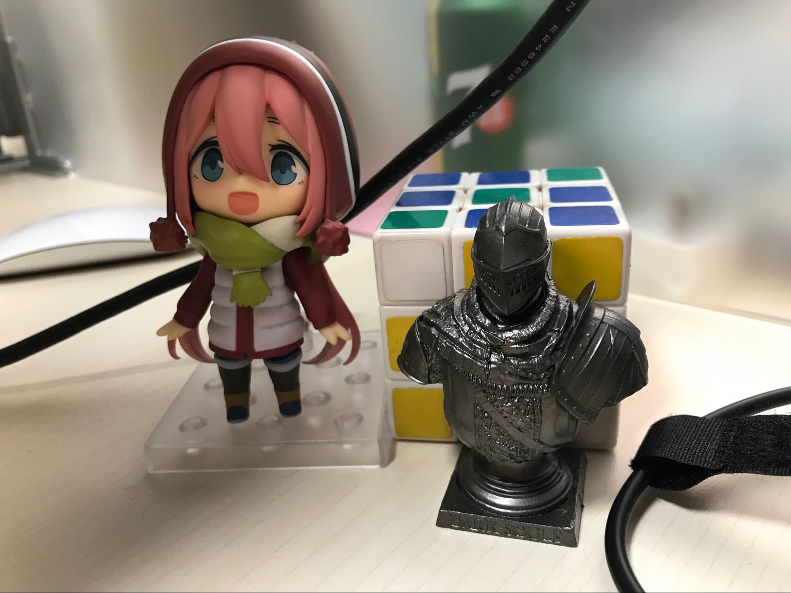

# html中如何缩放图片而不使图片拉伸变形
前端页面显示图片通常都不会进行拉伸变形，但有时原始图片的长宽比和显示图片的位置不同，这时要怎么显示呢？

此时有两种缩放方式，一种是contain，一种是cover。

### 1. contain方式
缩放后，显示完整的图片，图片长边能完整显示。

优点：完整显示图片；
缺点：有黑边。


img:
```
        

        .img-crop-contain {
            height: 20vh;
            width: 20vh;
            object-fit: contain;
            border: solid 1px black;
            background: gray;
        }
```

background:
```
        <div class="the-image scale-contain"></div>

        .the-image {
            background-image: url("image/QQ20181210-1.jpg");
            background-repeat: no-repeat;
        }
        .scale-contain {
            background-size: contain;
            background-position: center center;
            width: 20vh;
            height: 20vh;
            border: solid 1px black;
        }
```

### 2. cover方式
缩放后，裁剪图片的一部分，只显示图片的中间部分。保证图片的短边完全显示，长边裁剪。不会有黑边。

优点：没有黑边，显示较为美观
缺点：图片被裁剪


img:
```
        

        .img-crop-cover {
            height: 20vh;
            width: 20vh;
            object-fit: cover;
        }
```

background:
```
        <div class="the-image no-stretch-cover"></div>

        .the-image {
            background-image: url("image/QQ20181210-1.jpg");
            background-repeat: no-repeat;
        }
        .no-stretch-cover {
            background-size: cover;
            background-position: center center;
            width: 20vh;
            height: 20vh;
        }
```
